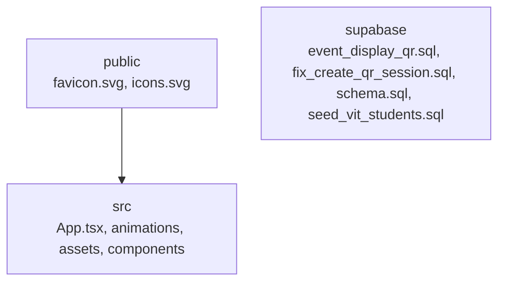

# Attendly — Smart QR Attendance Management System

Production-ready college attendance system built with **React 19**, **TypeScript**, **Vite**, **Tailwind CSS**, and **Supabase**.

Students log in with Registration Number + Name, generate a **dynamic QR** that refreshes every **60 seconds**, and admins mark attendance by scanning through the built-in webcam scanner. Duplicate attendance on the same day is blocked by a database unique constraint.

## Features

- Premium landing page (glassmorphism, dark/light mode, animations)
- Student login (reg no + name verification)
- Admin login via Supabase Auth + role check
- Dynamic QR with countdown, download, fullscreen
- Continuous QR scanner (`html5-qrcode`)
- Student CRUD + CSV import/export
- Attendance table with search, filter, sort, pagination
- CSV + PDF reports
- Analytics charts (Recharts)
- Realtime attendance updates
- Offline scan queue with sync
- Camera switching, scan sound, success animation

## Setup

### 1. Install

```bash
npm install
```

### 2. Configure environment

Copy `.env.example` to `.env` and fill in your Supabase project values:

```env
VITE_SUPABASE_URL=https://xxxx.supabase.co
VITE_SUPABASE_ANON_KEY=your-anon-key
```

### 3. Database

In the Supabase SQL Editor, run the full script:

[`supabase/schema.sql`](./supabase/schema.sql)

This creates:

- `students`, `attendance`, `admins`, `qr_sessions`
- Unique `(registration_number, attendance_date)`
- RLS policies
- RPCs: `verify_student_login`, `create_qr_session`, `mark_attendance_from_qr`
- Realtime publication for `attendance`

### 4. Create an admin

1. Create a user in **Supabase Auth** (email/password).
2. Insert into `admins`:

```sql
INSERT INTO admins (id, email, role, full_name)
VALUES ('<auth-user-uuid>', 'admin@college.edu', 'admin', 'System Admin');
```

### 5. Seed students (optional)

Uncomment the sample inserts at the bottom of `schema.sql`, or use **Admin → Students → Import CSV**.

CSV headers:

```text
Registration Number,Name,Programme,Department,Batch,Email
```

### 6. Run

```bash
npm run dev
```

## Workflow

1. **Student** → `/student/login` → Generate QR (rotates every 60s)
2. **Admin** → `/admin/login` → QR Scanner → webcam auto-starts
3. Scan marks attendance once per day; re-scan shows **Attendance Already Marked**

## Scripts

| Command         | Description              |
| --------------- | ------------------------ |
| `npm run dev`   | Start Vite dev server    |
| `npm run build` | Typecheck + production build |
| `npm run preview` | Preview production build |

## Security notes

- QR codes contain short-lived session tokens stored in `qr_sessions`
- Attendance marking uses a `SECURITY DEFINER` RPC with expiry + unique constraint checks
- Admin routes require Supabase session **and** a row in `admins`
- Student session is stored locally after verified login against `students`

## Stack

React 19 · TypeScript · Vite · Tailwind CSS v4 · Framer Motion · React Router · React Hook Form · Zod · Lucide · Supabase · qrcode · html5-qrcode · Recharts · React Hot Toast · jsPDF · PapaParse
# attendly

## Setup Guide

### Backend Setup

_From `README.md`:_


### 1. Install

```bash
npm install
```

### 2. Configure environment

Copy `.env.example` to `.env` and fill in your Supabase project values:

```env
VITE_SUPABASE_URL=https://xxxx.supabase.co
VITE_SUPABASE_ANON_KEY=your-anon-key
```

### 3. Database

In the Supabase SQL Editor, run the full script:

[`supabase/schema.sql`](./supabase/schema.sql)

This creates:

- `students`, `attendance`, `admins`, `qr_sessions`
- Unique `(registration_number, attendance_date)`
- RLS policies
- RPCs: `verify_student_login`, `create_qr_session`, `mark_attendance_from_qr`
- Realtime publication for `attendance`

### 4. Create an admin

1. Create a user in **Supabase Auth** (email/password).
2. Insert into `admins`:

```sql
INSERT INTO admins (id, email, role, full_name)
VALUES ('<auth-user-uuid>', 'admin@college.edu', 'admin', 'System Admin');
```


### Frontend Setup (Dashboard)

```bash

npm install
npm run dev     # development
npm run build && npm start   # production
```

Open `http://localhost:3000` (or the port shown in the terminal).

### Configuration

Copy environment templates before running:

- `.env.example` → copy to `.env` in the same directory

Dashboard connects to the TTS server via `NEXT_PUBLIC_TTS_SERVER` (default `http://127.0.0.1:8001`).

### Running the Application

1. **Start the backend** (TTS server on port `8001`)
2. **Start the dashboard** (`npm run dev` in `dashboard/`)
3. Open the dashboard and verify engine status shows **online**

```bash
# Terminal 1 — Backend
cd movio-indicvoice && python -m server.main

# Terminal 2 — Frontend
cd dashboard && npm run dev
```

## System Architecture

High-level system design, data flows, API map, and workflow pipelines derived from the repository structure.

### System Architecture


