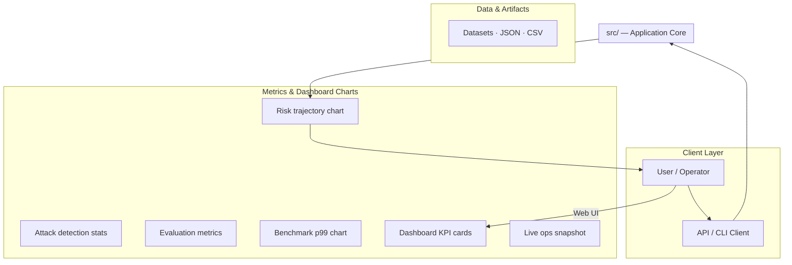
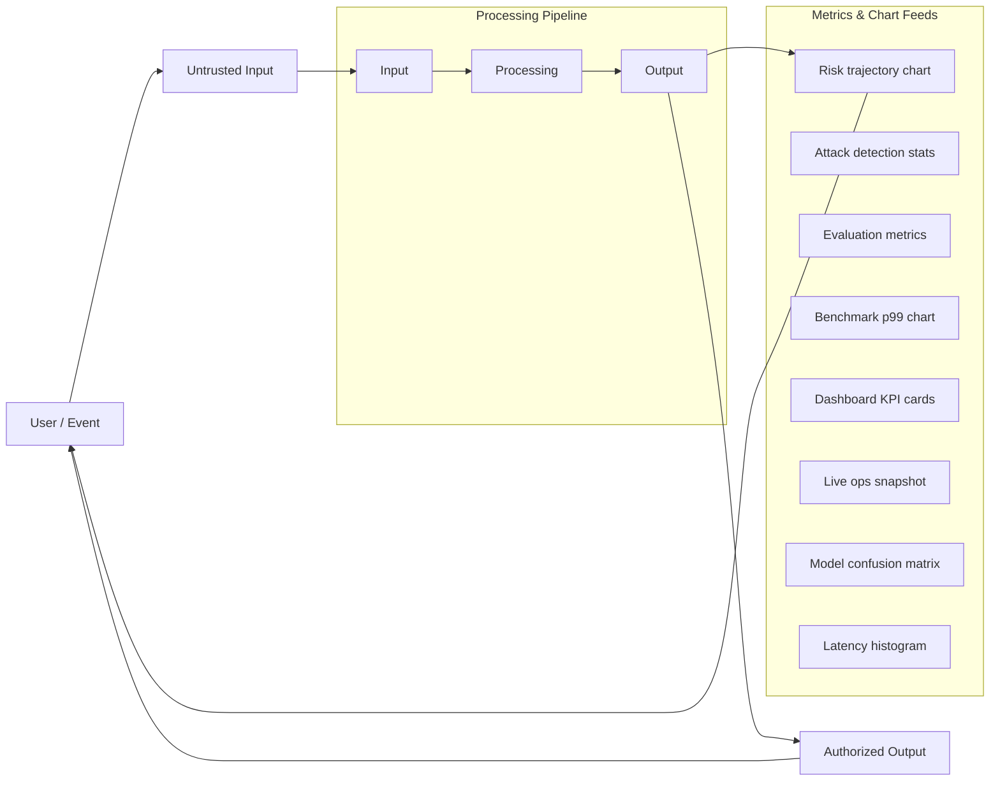
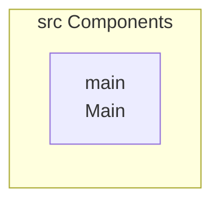
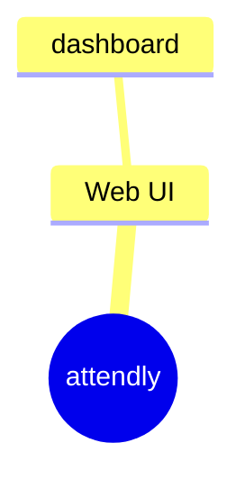

## Setup Guide

### Backend Setup

_From `README.md`:_


### 1. Install

```bash
npm install
```

### 2. Configure environment

Copy `.env.example` to `.env` and fill in your Supabase project values:

```env
VITE_SUPABASE_URL=https://xxxx.supabase.co
VITE_SUPABASE_ANON_KEY=your-anon-key
```

### 3. Database

In the Supabase SQL Editor, run the full script:

[`supabase/schema.sql`](./supabase/schema.sql)

This creates:

- `students`, `attendance`, `admins`, `qr_sessions`
- Unique `(registration_number, attendance_date)`
- RLS policies
- RPCs: `verify_student_login`, `create_qr_session`, `mark_attendance_from_qr`
- Realtime publication for `attendance`

### 4. Create an admin

1. Create a user in **Supabase Auth** (email/password).
2. Insert into `admins`:

```sql
INSERT INTO admins (id, email, role, full_name)
VALUES ('<auth-user-uuid>', 'admin@college.edu', 'admin', 'System Admin');
```


### Frontend Setup

```bash

npm install
npm run dev     # development
npm run build && npm start   # production
```

Open `http://127.0.0.1:5173` (or the port shown in the terminal).

### Configuration

Copy environment templates before running:

- `.env.example` → copy to `.env` in the same directory

### Running the Application

1. **Start web app** — `npm run dev` in `./`

```bash
cd .
npm install
npm run dev
```

## System Architecture

High-level system design, data flows, API map, and workflow pipelines derived from the repository structure.

### System Architecture



### Data Flow & Charts Pipeline



### Component & API Map



### Dashboard Page Map


