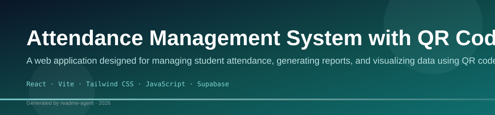
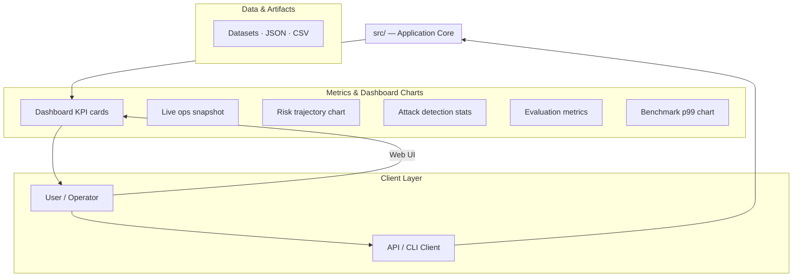
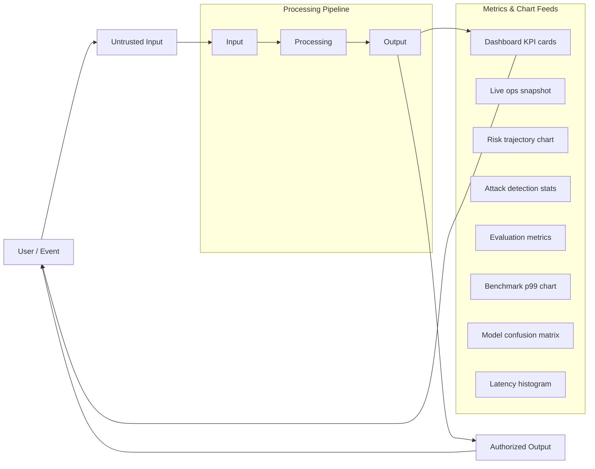
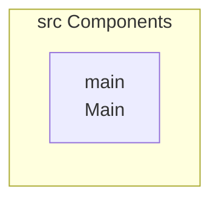
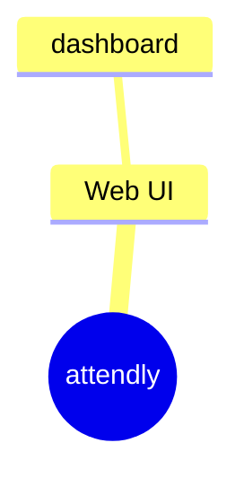
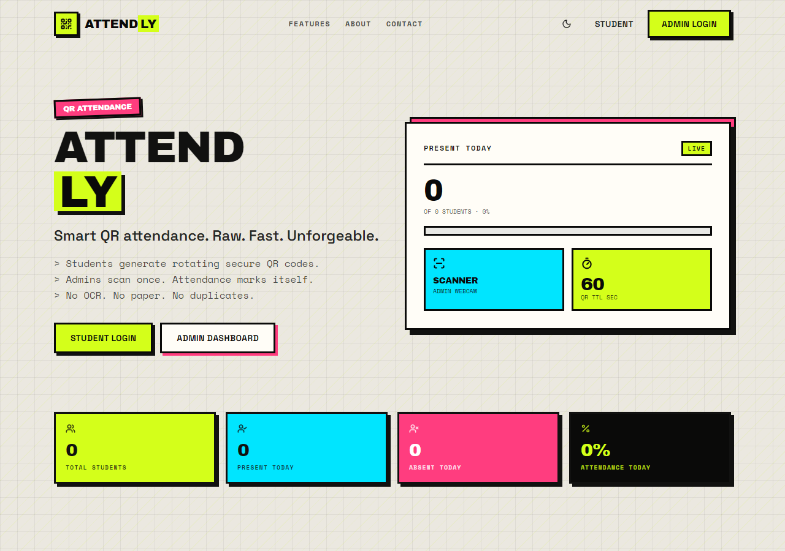
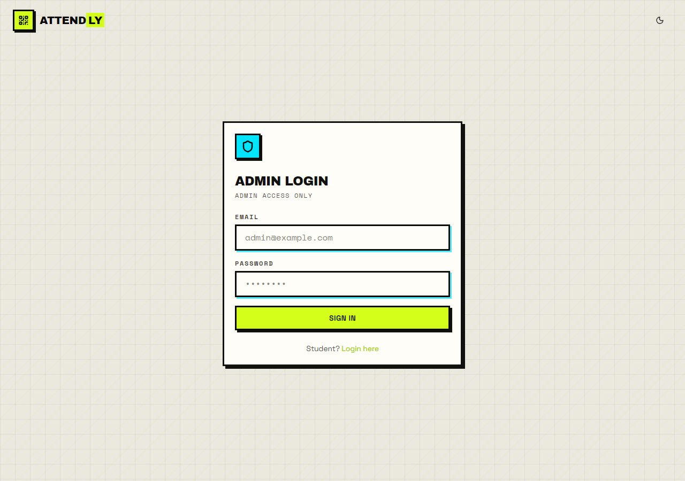
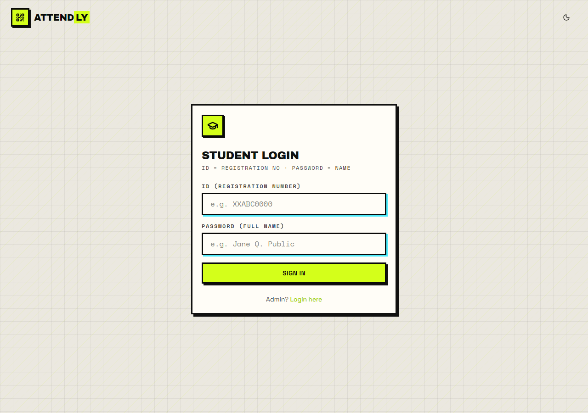

# Attendance Management System with QR Code Integration

A web application designed for managing student attendance, generating reports, and visualizing data using QR code scanning and a Supabase backend.

## Overview

This project is a comprehensive web application built using React and Vite, designed to streamline the process of taking and managing student attendance. The system utilizes QR code scanning for efficient check-in, integrates with Supabase for secure data storage and authentication, and provides detailed dashboards and PDF reporting capabilities. The architecture emphasizes a controlled data flow, ensuring that all input is processed and authorized before being used for reporting.

## Problem

The system aims to solve the challenge of manual, inefficient, and error-prone attendance tracking. By implementing a digital, QR-code-based system, it provides administrators with a centralized, real-time, and auditable record of student presence.

## Solution

The solution is a web portal that allows authorized administrators to initiate QR code sessions. Students use their devices to scan the generated QR code, which registers their attendance in the database. The system then processes this raw data to generate various reports, dashboards, and historical records, all secured by Supabase's Row Level Security (RLS) and custom stored procedures.

## Key Features

- QR Code Attendance Scanning: Uses `html5-qrcode` to scan student QR codes for attendance marking.
- Admin Role Management: Defines specific roles and permissions for administrators.
- Session Management: Allows the creation and tracking of specific attendance sessions (`qr_sessions`).
- Data Visualization: Features interactive dashboards using `recharts` to display attendance statistics, risk trajectories, and performance metrics.
- Reporting and Export: Ability to generate and download detailed attendance reports in PDF format using `jspdf` and `jspdf-autotable`.
- Secure Backend Integration: Leverages Supabase for authentication, database storage, and complex business logic via Remote Procedure Calls (RPCs).

## Technology Stack

- React
- Vite
- Tailwind CSS
- JavaScript
- Supabase
- react-hook-form
- zod
- recharts
- html5-qrcode
- qrcode

## Setup Guide

### Frontend Setup

```bash

npm install
npm run dev     # development
npm run build && npm start   # production
```

Open `http://127.0.0.1:5173` (or the port shown in the terminal).

### Configuration

Copy environment templates before running:

- `.env.example` → copy to `.env` in the same directory

### Running the Application

1. **Start web app** — `npm run dev` in `./`

```bash
cd .
npm install
npm run dev
```

## System Architecture

High-level system design, data flows, API map, and workflow pipelines derived from the repository structure.

### System Architecture



### Data Flow & Charts Pipeline



### Component & API Map



### Dashboard Page Map



## Application Pages

Screenshots captured from the running application. Each page is listed with its function.

### Application

#### Home

Home — application page at `/`


### Admin

#### Dashboard

Dashboard — application page at `/admin`



#### Admin/Login

Admin/Login — application page at `/admin/login`



### Public

#### Student/Login

Student/Login — application page at `/student/login`


